<!-- PeterBarbas/PeterBarbas -->

 

I turn vague ambition into shipped software. Currently building my own thing; previously the
person making sure everyone else's thing landed.

Founder, TPM and engineer — which mostly means I write the doc, cut the scope, then open the
pull request myself. I work in public because the interesting part is the middle, not the launch.

`TypeScript` &nbsp;`Python` &nbsp;`React` &nbsp;`Postgres` &nbsp;`AWS` &nbsp;`Roadmaps that survive reality`

<!-- Trim the list above to what you actually use. -->

**Now** — building in public, one commit at a time

**Learning** — <!-- your next thing -->

**Elsewhere** — [linkedin](https://linkedin.com/in/YOUR-HANDLE) · [x](https://x.com/YOUR-HANDLE) · [website](https://YOUR-SITE.com) · [email](mailto:you@example.com)

<picture>
  <source media="(prefers-color-scheme: dark)" srcset="https://raw.githubusercontent.com/PeterBarbas/PeterBarbas/output/github-snake-dark.svg" />
  <source media="(prefers-color-scheme: light)" srcset="https://raw.githubusercontent.com/PeterBarbas/PeterBarbas/output/github-snake.svg" />
  
</picture>

the snake eats this graph nightly — generated by a GitHub Action

  

  

<i>Open an issue on this repo to say hi — I answer all of them.</i>

